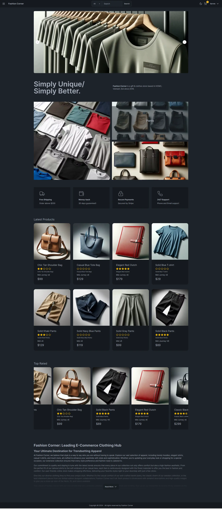

# FashionCorner - Next.js 14 Fullstack Ecommerce App

Features:

- Tailwind design + DaisyUI, Shadcn/ui 
- Typescript
- MongoDB integration
- Cloudinary integration
- NProgress integration
- React Hook Form
- Admin dashboard
- SEO Friendly Application - (SSR)
- Plaiceholder blurred images
- PayPay integration (Stripe will be added soon) 
- Server Side Pagination

##  [Visit project url](https://fashion-corner.vercel.app/)

  

  

